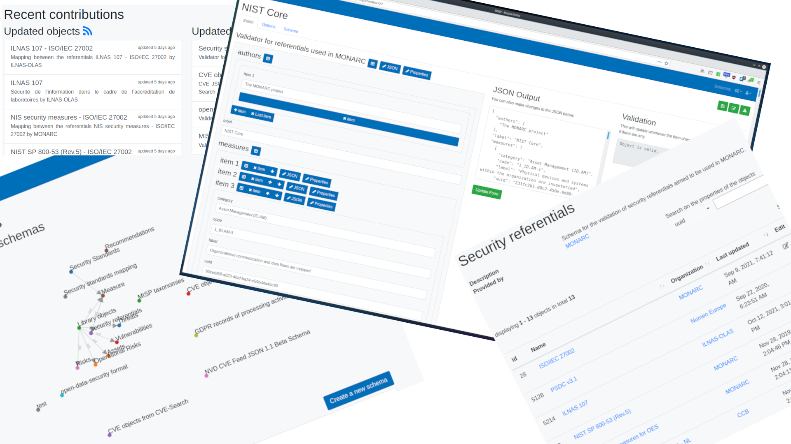

# MONARC Objects Sharing Platform

## Presentation

[MOSP](https://github.com/CASES-LU/MOSP) is a platform for creating, editing
and sharing *validated* JSON objects of any type.

You can use any available JSON schemas in order to create new JSON objects via a
Web form dynamically generated and based on the selected JSON schema.

Since MOSP is a collaborative platform, all changes to JSON objects are tracked.

It is also possible to interact with MOSP programmatically thanks to its API.
You can use [PyMOSP](https://github.com/CASES-LU/PyMOSP) if you need a client.

As example you can have a look at [official instance](https://objects.monarc.lu)
operated by [CASES](https://github.com/CASES-LU) and more particularly the
[objects](https://objects.monarc.lu/organization/MONARC) shared by the
[MONARC project](https://github.com/monarc-project).
The goal is to gather security related JSON objects, in the first place aimed
to be used with MONARC.
Some JSON objects can be exported to a
[MISP galaxy](https://github.com/MISP/misp-galaxy).

## Installation

Instructions resides [here](docs/installation.rst).

## Documentation

A [documentation](https://www.monarc.lu/documentation/MOSP-documentation)
is available on the MONARC website.

## Contributing

Please read the [CONTRIBUTING](CONTRIBUTING.md) instructions.

## License

This software is licensed under
[GNU Affero General Public License version 3](https://www.gnu.org/licenses/agpl-3.0.html)

* Copyright (C) 2018-2022 Cédric Bonhomme
* Copyright (C) 2018-2022 SECURITYMADEIN.LU

For more information, the [list of authors and contributors](AUTHORS.md) is
available.
